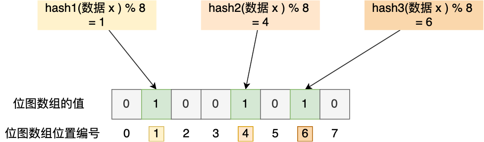

###Redis

####Redis缓存雪崩

- 大量数据同时过期
- Redis故障宕机

####大量数据同时过期

- 均匀设置过期时间
- 互斥锁
- 后台更新缓存

#####1、均匀设置过期时间

如果要给缓存数据设置过期时间，应该避免将大量的数据设置成同一个过期时间。我们可以在对缓存数据设置过期时间时，给这些数据的过期时间加上一个随机数，这样就保证数据不会在同一时间

#####2、互斥锁

当业务线程在处理用户请求时，如果发现访问的数据不在Redis里，就加一个互斥锁，保证同一时间内只有一个请求来构建缓存（从数据库读取数据，再将数据更新到Redis里），当缓存构建完成后，再释放锁。未能获取互斥锁的请求，要么等待锁释放后重新读取缓存，要么就返回值或者默认值。

实现互斥锁的时候，最好设置超时时间，不然第一个请求拿到了锁，然后这个请求发生某种意外而一直阻塞，一直不释放锁，这时其他请求也一直拿不到锁，整个系统就会出现无响应的现象。

#####3、后台更新缓存

业务线程不再负责更新缓存，缓存也不设置有效期，**而是让缓存"永久有效"**，并将更新缓存的工作交由后台更新定时更新。

事实上，缓存数据不设置有效期，并不是意味着数据一直能在内存里，因为当系统内存紧张的时候，有些缓存数据会被"淘汰"，而在缓存被"淘汰"到下一次后台定时更新缓存的这段时间内，业务线程读取缓存失败就返回空值，业务的视角就以为是数据丢失了。

解决上面的问题的方式有两种。

第一种方式，后台线程不仅负责定时更新缓存，而且也负责**频繁地检测缓存是否有效**，检测到缓存失效了，原因可能是系统紧张而被淘汰的，于是就要马上从数据库读取数据，并更新到缓存。

这种方式的检测时间间隔不能太长，太长也导致用户获取的数据是一个空值而不是真正的数据，所以检测时间最好是毫秒级别的，但是总归是有个间隔时间，用户体验一般。

第二种方式，在业务线程发现缓存数据失效后（缓存数据被淘汰），通过消息队列发送一条消息通知后台线程更新缓存，后台线程收到消息后，在更新缓存前可以判断缓存是否存在，存在就不执行更新缓存操作；不存在就读取数据库数据，并将数据加载到缓存。这种方式相比第一种方式缓存的更新会更及时，用户体验比较好。

在业务刚上线的时候，我们最好提前把数据缓存起来，而不是等待用户访问在触发缓存构建，这就是所谓**缓存预热**，后台更新缓存的机制刚好也适合干这个事情。

####Redis故障宕机

- 服务熔断或请求限流机制；
- 构建Redis缓存高可靠集群；

#####1、服务熔断或请求限流限制

因为Redis故障宕机而导致缓存雪崩问题时，我们可以启动**服务熔断**机制，**暂停业务应用对缓存服务的访问，直接返回错误**，不用再继续访问数据库，从而降低对数据库的访问压力，保证数据库系统的正常运行，然后等到Redis恢复正常后，再允许业务应用访问缓存服务。

服务熔断机制保护数据库的正常允许，但是暂停了业务应用访问缓存服务系统，全部业务都无法正常工作

为了减少对业务的影响，我们可以启用请求限流机制，只将少部分请求发送到数据库进行处理，再多请求就在入口直接拒绝，等到Redis恢复正常并把缓存预热完后，再接触请求限流的限制。

#####2、构建Redis缓存高可靠集群

服务熔断或请求限流机制是缓存雪崩发生后的应对方案，我们最好通过主从节点的方式构建Redis缓存高可靠集群。

如果Redis缓存的主节点故障宕机，从节点可以切换成为主节点，继续提供缓存服务，避免了由于Redis故障宕机而导致的缓存雪崩问题。

####缓存击穿

- 互斥锁方案，保证同一时间只有一个业务线程更新缓存，未能获取互斥锁的请求，要么等待锁释放后重新读取缓存，要么就返回空值或者默认值。
- 不给热点数据设置过期时间，由后台异步更新缓存，或者在热点数据准备要过期前，提前通知后台线程更新缓存以及重新设置过期时间；

####缓存穿透

当发生缓存雪崩或击穿时，数据库中还是保存应用要访问的数据，一旦缓存恢复对应的数据，就可以减轻数据库的压力，而缓存穿透就不一样了。

当用户访问的数据，**既不在缓存中，也不在数据库中**，导致请求在访问缓存时，发现缓存缺失，再去访问数据库时，发现数据库中也没有要访问的数据，没办法构建缓存数据，来服务后续的请求。那么当有大量这样的请求到来时，数据库的压力骤增，这就是缓存穿透的问题。

一般发生在两种情况；

- 业务误操作，缓存中的数据和数据库中的数据都被误删除了，所以导致缓存和数据库中都没有数据；
- 黑客恶意攻击，故意大量访问某些读取不存在数据的业务；

应对缓存穿透的方案，常见的三种；

- 非法请求的限制
- 缓存空值或默认值
- 使用布隆过滤器快速熔断数据是否存在，避免通过查询数据库来判断数据是否存在

第一种方案，非法请求的限制

当有大量恶意请求访问不存在的数据的时候，也会发生缓存穿透，因此在API入口处我们要判断请求参数是否合理，请求参数是否含有非法值、请求字段是否存在，如果判断出是恶意请求就直接返回错误，避免进一步访问访问缓存或数据库。

第二种方案，缓存空值或者默认值

当我们线上业务发现缓存穿透的现象时，可以针对查询的数据，在缓存中设置一个空值或者默认值，这样后续请求就可以从缓存中读取到空值或者默认值，返回给应用，而不会继续查询数据库

**第三种方案，使用布隆过滤器快速判断数据是否存在，避免通过查询数据库来判断数据是否存在**

我们可以在写入数据库时，使用布隆过滤器做个标记，然后在用户请求到来时，业务线程确认缓存失效后，可以通过查询布隆过滤器快速判断数据是否存在，如果不存在，就不用通过查询数据库来判断数据是否存在。

即使发生了缓存穿透，大量请求只会查询Redis和布隆过滤器，而不会查询数据库，保证了数据库能正常运行，Redis自身也是支持布隆过滤器。

那问题来了，布隆过滤器是如何工作的呢？接下来我们来介绍一下

布隆过滤器由【初始值都为0的位图数组】和【N个哈希函数】两部组成。当我们写入数据库数据时，在布隆过滤器做个标记，这样下次查询数据是否在数据库时，只需要查询布隆过滤器，如果查询到数据没有标记，说明不在数据库中。

布隆过滤器会通过3个操作完成标记：

第一步，使用N个哈希函数分别对数据做哈希计算，得到N个哈希值；

第二步，将第一步得到的N个哈希值对位图数组的长度取模，得到每个哈希值在位图数组的对应位置；

第三步，将每个哈希值在位图数组的对应位置的值设置为1。

举个例子，假设有一位图长度为8，哈希函数3个的布隆过滤器

写入数据库写入数据x后，把数据x标记在布隆过滤器时，数据x会被3个哈希函数分别计算出3个哈希值，然后在对这3个哈希数值，然后在对这3个哈希值对8取模，假设取模的结果为1、4、6，然后把位图数组的第1、4、6位置的值设置为1。**当应用查询x数据是否在数据时，通过布隆过滤器只要查到位图数组的第1、4、6位置是否都为1，只要有一个为0，就认为数据不在数据中。

布隆过滤器由于基于哈希函数实现查找的，高效查询查找的同时存在哈希冲突的可能性，比如数据x和数据y可能都落在1、4、6位置上，而事实上，可能数据并存在数据y，存在误判的情况。

所以，查询布隆过滤器说数据存在，并不一定证明数据库中存在这个数据，但是查询到数据不存在，数据库一定不存在这个数据。

