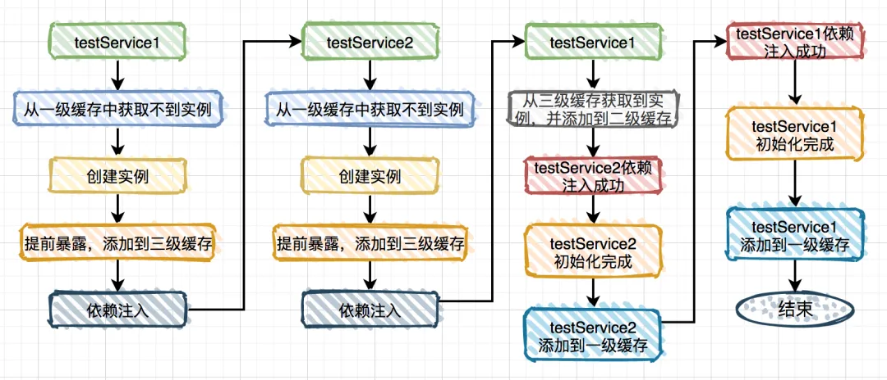
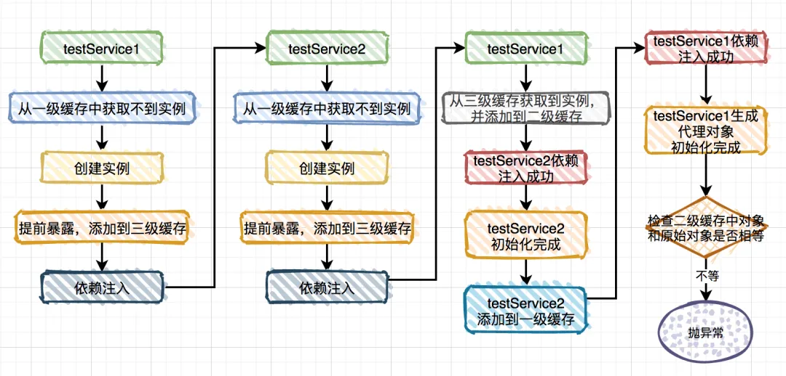

##Spring学习

###Spring如何解决循环依赖
    
三级缓存：
- **SingletonObjects**:一级缓存，用于保存实例化完成、依赖、初始化完成的bean实例
- **earlySingletonObjects**:二级缓存，用于保存实例化完成的依赖
- **SingletonFactories**:三级缓存，用于保存bean创建的工厂，以便于后面扩展有机会创建代理对象





####单例的代理对象setter注入
这种注入方式其实也比较常用，比如平时使用：```@Async```注解的场景，会通过AOP自动生成代理对象。


```java

@Service
publicclass TestService1 {

    @Autowired
    private TestService2 testService2;

    @Async
    public void test1() {
    }
}

```

```java

@Service
publicclass TestService2 {

    @Autowired
    private TestService1 testService1;

    public void test2() {
    }
}


```
会出现这个错误


```java
org.springframework.beans.factory.BeanCurrentlyInCreationException: Error creating bean with name 'testService1': Bean with name 'testService1' has been injected into other beans [testService2] in its raw version as part of a circular reference, but has eventually been wrapped. This means that said other beans do not use the final version of the bean. This is often the result of over-eager type matching - consider using 'getBeanNamesOfType' with the 'allowEagerInit' flag turned off, for example.

```




Spring的``org.springframework.beans.factory.support.AbstractAutowireCapableBeanFactory.doCreateBean``方法里

```java

if (earlySingletonExposure) {
			Object earlySingletonReference = getSingleton(beanName, false);
			if (earlySingletonReference != null) {
				if (exposedObject == bean) {//这里发现二级缓存和原始对象不想等
					exposedObject = earlySingletonReference;
				}
				else if (!this.allowRawInjectionDespiteWrapping && hasDependentBean(beanName)) {
					String[] dependentBeans = getDependentBeans(beanName);
					Set<String> actualDependentBeans = new LinkedHashSet<>(dependentBeans.length);
					for (String dependentBean : dependentBeans) {
						if (!removeSingletonIfCreatedForTypeCheckOnly(dependentBean)) {
							actualDependentBeans.add(dependentBean);
						}
					}
					if (!actualDependentBeans.isEmpty()) {
						throw new BeanCurrentlyInCreationException(beanName,
								"Bean with name '" + beanName + "' has been injected into other beans [" +
								StringUtils.collectionToCommaDelimitedString(actualDependentBeans) +
								"] in its raw version as part of a circular reference, but has eventually been " +
								"wrapped. This means that said other beans do not use the final version of the " +
								"bean. This is often the result of over-eager type matching - consider using " +
								"'getBeanNamesOfType' with the 'allowEagerInit' flag turned off, for example.");
					}
				}
			}
		}
```


####解决办法

- 生成代理对象产生的循环依赖
    
    - 使用``@Lazy``注解,延迟加载
    - 使用``@DependsOn``注解，指定加载先后关系
    - 修改文件名称，改变循环依赖类型的加载顺序
    
- 使用``@DependsOn``产生的循环依赖
    
    - 这类循环依赖问题要找到``@DependsOn``注解循环依赖的地方，迫使它不循环依赖就可以解决问题
    
- 多例循环依赖

    - 这类循环依赖问题可以通过把bean改成单例的解决。
    
- 构造器循环依赖
    
    - 这类循环依赖问题通过使用``@Lazy``注解解决